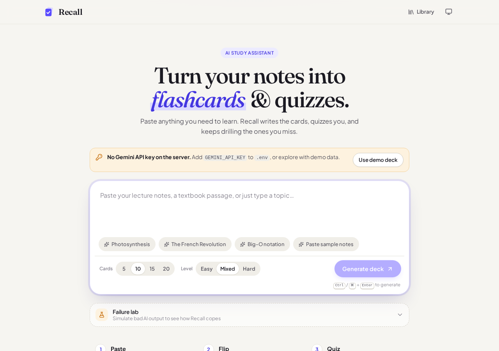
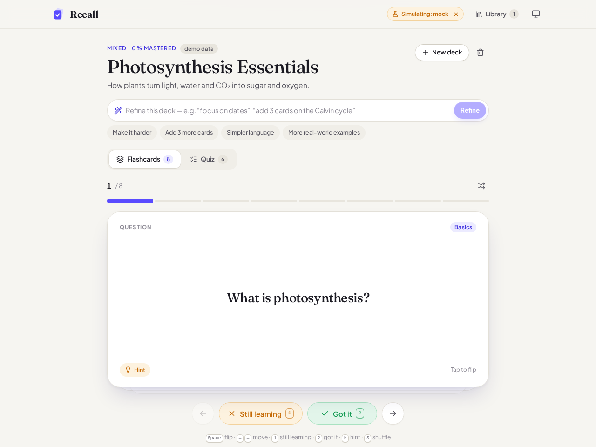
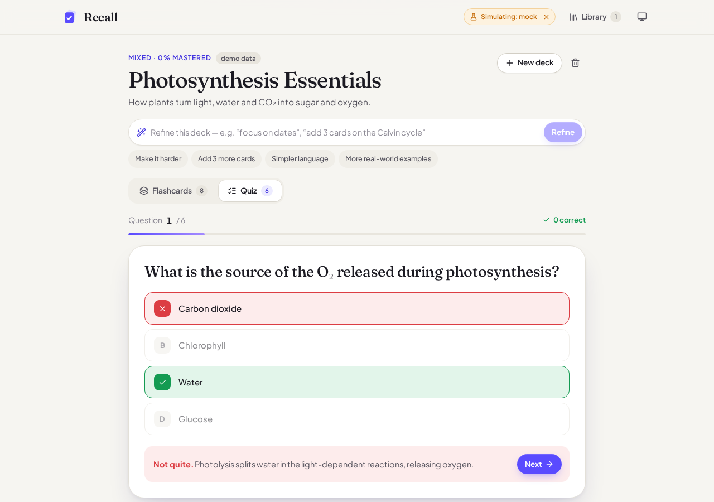
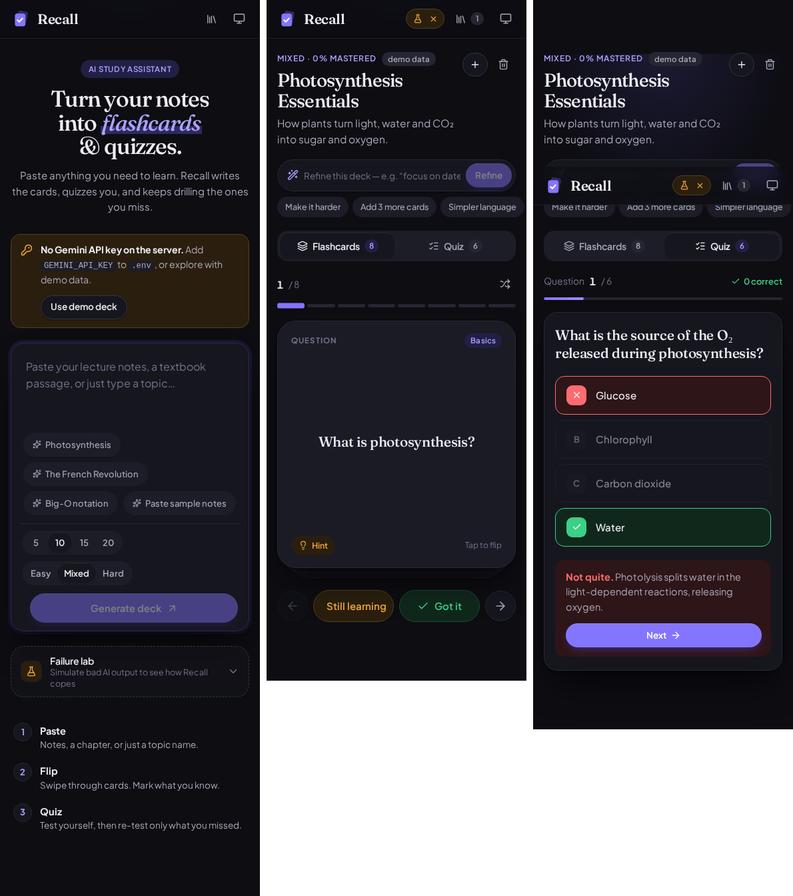

# Recall — AI study assistant

Paste your notes (or just a topic). Recall asks **Google Gemini** for a structured deck of flashcards and multiple‑choice questions, validates it, and turns it into an interactive study tool: flip cards, swipe to mark what you know, take the quiz, and **re‑test only the questions you got wrong**.

It is not a chatbot. The model returns JSON; the app parses it, validates it, and renders React components from it. Raw model text never reaches the UI.



| Flashcards | Quiz | Mobile (dark) |
|---|---|---|
|  |  |  |

---

## Quick start

Requires **Node 20.19+** (Node 22 recommended).

```bash
npm install
cp .env.example .env        # Windows: copy .env.example .env
# put your key in .env  →  GEMINI_API_KEY=...   (free key: https://aistudio.google.com/apikey)
npm start
```

Open **http://localhost:5173**.

`npm start` runs two processes:

| Process | Port | Job |
|---|---|---|
| `server/` (Express) | 8787 | Holds the API key, builds the prompt, streams Gemini's output back |
| Vite dev server | 5173 | Serves the React app and proxies `/api/*` to the Express server |

**No API key yet?** The app still runs. Click **Use demo deck** (or open the **Failure lab** and pick *Demo deck*) to use a built‑in sample deck.

Other scripts:

```bash
npm test          # unit tests (validation, JSON parsing, Gemini stream parsing)
npm run serve     # production build, served by the Express server on :8787
```

If you get *Model not found*, set `GEMINI_MODEL=gemini-flash-latest` (or any current Gemini model) in `.env`.

### Deploy to Render

The repo root has a `render.yaml` Blueprint that runs a single web service (Express serves both `/api` and the built app).

1. Push to GitHub.
2. Render dashboard → **New → Blueprint** → select the repo.
3. When prompted, paste your `GEMINI_API_KEY`, then **Apply**.

Build: `npm ci --include=dev && npm run build` · Start: `npm run start:prod` · Health check: `/api/health`. Set `ALLOW_SIMULATE=false` to hide the Failure lab in production.

---

## Features

**Core**
- Free‑form text input (notes, a textbook passage, or a topic name), plus card count (5–20) and difficulty.
- The AI returns structured JSON → validated → rendered as:
  - **Flashcards**: 3D flip; mark cards *Got it* / *Still learning*; swipe right or left on touch devices; a **review round** that only shows cards you're still learning; shuffle; hints.
  - **Quiz**: multiple choice with instant feedback and explanations; options are shuffled each round; a results screen; **re‑test the wrong answers** as many times as you need.
- Loading, error, and empty states for every screen. Works on mobile.

**Stretch goals implemented**
- **Streaming**: the deck streams in, and the loading screen shows each card's question as soon as it arrives.
- **Refinement loop**: follow‑up prompts ("make it harder", "add 3 cards on X") edit the current deck instead of generating a new one. While a refinement runs, the current deck stays visible. If it fails, the deck is left as it was. There is also **Undo**.
- **Save and reload sessions**: decks and progress are saved in `localStorage` and listed in the Library drawer.
- **Polish**: dark mode (system, light, dark), keyboard shortcuts everywhere, animations that respect `prefers-reduced-motion`, and toasts with undo.

---

## Architecture

```
server/
  index.js          Express: request validation, timeouts, typed errors, NDJSON streaming, Failure lab
  gemini.js         One fetch to Gemini's SSE endpoint + a small SSE parser (no SDK)
  prompt.js         Prompt text + responseSchema (the JSON contract)
  simulate.js       Fake model responses for every failure mode (Failure lab)
src/
  lib/
    api.js            The ONLY place the browser calls the backend; stream reader + total/stall timeouts
    parseJson.js      Raw text → JSON (handles code fences and text around the JSON), typed errors
    validateResult.js JSON → the Deck shape the UI renders; salvages partly broken output
    partialPreview.js Reads unfinished streamed JSON, only to show progress on the loading screen
    errors.js         AppError + user-facing copy per error code
  hooks/
    useDeckGenerator.js  Request lifecycle: latest-wins, abort, auto-retry, parse+validate
    useSessions.js       Saved decks (re-validated on load)
    useHotkeys.js, useTheme.js, useToast.js
  components/
    PromptInput, GeneratingState (loading), ErrorState, EmptyState,
    StudyView (routes a deck to its views), FlashcardDeck, Quiz, RefineBar,
    Library, FailureLab, …
```

### Data flow

```
PromptInput ─► useDeckGenerator.generate(payload)
                 │  aborts previous request, requestId++
                 ▼
             lib/api.streamDeck ──POST /api/generate──► server ──► Gemini (JSON mode + schema)
                 │  ◄── NDJSON: meta / delta… / done | error ──
                 ▼
             parseModelJson(text) ─► validateDeck(json) ─► { deck, warnings }
                 │                                   (any failure → AppError → ErrorState)
                 ▼
             App saves the session ─► StudyView ─► FlashcardDeck / Quiz
```

### The contract

```js
{
  title: string, summary: string,
  cards: [{ id, front, back, hint, tag }],
  quiz:  [{ id, question, options: string[2..6], answerIndex, explanation }]
}
```

The server requests this shape in two ways: the prompt describes it, and Gemini's `responseSchema` enforces it. **The client still validates everything.** JSON mode makes bad output less common, but it still happens: output gets cut off at the token limit, the model skips required fields, a quiz has one option, or the answer index points past the end of the options.

Ids are hashes of the card or question text. A card that a refinement leaves unchanged keeps its id, so your progress on it carries over.

---

## Handling bad AI output

Each failure has its own error code, message, and recovery action. None of them crash the app or leave it hanging silently. You can trigger every case yourself from the **Failure lab** on the home screen.

| Failure | How it's detected | What the user sees |
|---|---|---|
| **Malformed JSON** | `JSON.parse` fails after trying the raw text, text inside code fences, and the outermost `{…}` | "Wasn't valid JSON". **Retried automatically once**, then Try again / Edit notes / Details (raw output) |
| **Cut off** (hit the token limit) | Parse fails **and** `finishReason === 'MAX_TOKENS'` | "The answer was cut off", with advice to ask for fewer cards |
| **Plain text instead of JSON** | No `{` anywhere | "Replied in plain text instead of JSON" |
| **Wrong shape** | Valid JSON, but no `cards` or `quiz` array | "Wrong shape", listing the keys that were found. Retried automatically once |
| **Partly broken** | Some items fail validation | Valid items are **kept**, broken ones dropped, and a warning says what was skipped |
| **Nothing usable** | Right structure, zero valid items | "No usable cards" |
| **Empty** | Empty or whitespace‑only text | Counts as a failure, not as an empty deck |
| **Slow** | Live progress plus an elapsed‑time counter; "taking longer than usual" after 15s | Cancel anytime |
| **Hangs** | **Stall timer**: no bytes for 20s → abort. **Total timer**: 60s. Server timeout: 55s | "The response stalled" / "Took too long" + retry |
| **Connection drops** | The stream ends without the final `done` event | "Connection dropped mid‑answer" |
| **Provider errors** | Upstream 429, 401/403, 404, 5xx, safety block → typed codes | Specific messages (rate limit, bad key, model not found, blocked) |
| **Server down** | `fetch` rejects, or the proxy returns a non‑JSON 5xx | "Couldn't reach the Recall server. Is it running?" |
| **Stale response** | Starting a new request **aborts** the old one, and a `requestId` check drops any late result | An older, slower answer can never overwrite a newer one (try *Slow stream* → Cancel → generate again) |
| **Refinement fails** | Same pipeline | Inline error above the deck; **the existing deck is not touched** |
| **Corrupt saved data** | Saved sessions go back through `validateDeck` on load; storage errors are caught | Bad entries are dropped silently and the app still loads |
| **Render bug** | React `ErrorBoundary` | A "Reload" screen instead of a blank page |

The request is also validated on the server: empty input, input over 15k characters, and a missing deck on a refine are all rejected before a model call is spent.

---

## Keyboard shortcuts

| Where | Keys |
|---|---|
| Input | `Ctrl/⌘ + Enter` generate |
| Flashcards | `Space` flip · `←/→` move · `1` still learning · `2` got it · `H` hint · `S` shuffle |
| Quiz | `1–4` / `A–D` answer · `Enter` next |
| Library | `Esc` close |

---

## Security notes

- The Gemini key lives only in `.env` on the server. It is sent to Google in the `x-goog-api-key` header (never in a URL), and it never appears in the frontend bundle. Only `/api/generate` and `/api/health` are exposed, and `/api/health` reports only *whether* a key is set.
- `.env` is git‑ignored.
- The Failure lab can be turned off with `ALLOW_SIMULATE=false`.

---

## AI usage note

> ⚠️ **Edit this section so it's true for you before you submit.** Be specific and honest about what you did yourself.

This project was built with an AI coding assistant (**Claude**, by Anthropic). The assistant generated most of the initial code: the React components, the CSS design system, the Express proxy, the validation layer, and the tests. It did this from my instructions and the assignment brief. I chose the project and the provider, reviewed and ran the code, and tested every failure mode through the Failure lab. *(Add what you changed, debugged, or decided yourself, and anything you'd do differently.)*

I made sure I understand each part well enough to explain it and extend it. In particular: the stale‑request guard in `useDeckGenerator.js`, the parsing and validation pipeline, and the NDJSON streaming protocol between `server/index.js` and `src/lib/api.js`.

---

## Known limitations

- **Sessions are per‑browser** (`localStorage`). There is no sync between devices and no accounts, as the brief allows.
- **Refinement resends the whole deck** and gets the whole deck back. That is simple and robust, but slower for big decks than a diff or patch format would be.
- **Streaming preview is best‑effort.** It reads unfinished JSON with regular expressions only to show progress. The real deck always comes from a full parse.
- **Auto‑retry happens once**, and only for bad model output (malformed, wrong shape, empty). Network or provider errors are not retried automatically, so a rate limit doesn't get hit twice.
- **No rate limiting on our own `/api` route.** A deployed version should add per‑IP limits.
- The quiz always asks for 4 options, but the validator accepts 2–6.
- Flashcard swiping uses pointer events. It is tested with mouse and touch emulation, not on every real device.

## What I'd do next

- A per‑IP rate limit and request logging on the server
- Spaced repetition (SM‑2) scheduling instead of simple known/learning flags
- Diff‑based refinement, where the model returns only the changed cards
- Component tests (React Testing Library) for the Flashcard and Quiz state machines
- Deploy: Vercel/Netlify function for `/api/generate`, plus static hosting for the frontend

## Time spent

> ✏️ Fill in honestly, e.g. *~X hours*: setup & data shape · backend proxy · validation · UI · testing · README.
